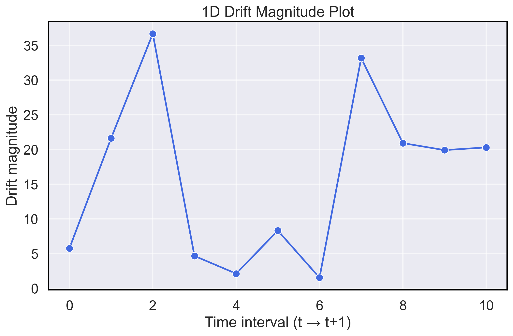

# SAMBO Rolling Stability Lab

[](https://github.com/jbhiggi/Strategy-Surface-Stability-Analysis/actions/workflows/ci.yml)


## 📋 Quick Navigation

| Section              | Link |
|----------------------|------|
| 🚀 Executive Summary | [Jump to Executive Summary](#executive-summary) |
| 🎯 Motivation        | [Jump to Motivation](#motivation) |
| 🔬 Methodology       | [Jump to Methodology](#methodology) |
| 📊 Experiments       | [Jump to Experiments](#experiments) |
| 🖼️ Results           | [Jump to Results](#results) |
| ⚙️ How to Reproduce  | [Jump to How-to-Reproduce](#how-to-reproduce) |
| 📘 User Guide        | [Jump to User Guide](#user-guide) |
| 🚧 Limitations       | [Jump to Limitations & Next Steps](#limitations--next-steps) |
| 📚 Further Docs      | [Jump to Further Documentation](#further-documentation) |
| 📂 Directory Structure | [Jump to Directory Structure](#directory-structure) |

---

## Executive Summary

This project studies the **stability of optimal parameter regions** for a simple trading strategy over time. Rather than asking *“what’s the best EMA crossover today?”*, the central question is: *“how stable is that region of good parameters across market regimes?”*

* **Strategy:** SMA and RSI as a momentum indicator.
* **Optimizer:** Sample-efficient Bayesian Optimization (SAMBO).
* **Rolling windows:** Optimize in each period, track parameter drift.
* **Stability metrics:** **Jaccard overlap** (region similarity) & **centroid drift** (param shift).
* **Deliverables:** Reproducible runs, polished figures, full pipeline.

---

## Motivation

Traditional backtests often overfit by selecting a single "optimal" parameter set. In reality:

* Markets evolve through regimes.
* Transaction costs and slippage shift the landscape.
* Single-point estimates are fragile.

To address this, we focus on consistent **regions of stability** throughout time — not a single fragile point.

---

## Methodology

We implement a versatile methodology that allows any ruled-based trading strategy to be optimized for a suite of metrics (Sharpe ratio, percentage return, etc.) while simultaneously checking robustness throughout different regimes:

```
Data → Rolling Windows → Optimize (SAMBO) → Interpolate to Uniform Grid
    → Gaussian Smoothing → Top-X% Region → Stability Metrics (Jaccard, Centroid Drift)
    → Walk-forward Test → Figures & Report
```
Our [pipeline](docs/methodology.md) utilizes SAMBO (Sample-efficient Adaptive Model-Based Optimization) to perform optimization across parameter space by iteratively sampling parameter candidates using a Bayesian approach. It builds a surrogate model of the performance surface we want to optimize over, and uses that model to  balance exploration vs exploitation. This results in a vastly more efficient modelling procedure than random or brute-force grid search.

We interpolate the SAMBO surface onto a uniform grid, enabling seamless analysis of parameter landscapes across time. Alongside heatmaps of each time interval, we produce plots of the evolution of the [Jaccard Index](docs/jaccard.md), and a modified version of the [Bernoulli-Shannon entropy](docs/entropy.md) per cell.

---

## Experiments

We use a simple [trading strategy](docs/strategy.md) for illustrative purposes. We are *NOT* recommending this strategy for actual deployment, only to demonstrate the capabilities of our pipeline across a variety of asset classes.

* **Baseline strategy:** SMA acts as a trend filter; entries and exits are triggered by [RSI](docs/RSI.md) relative to $\theta$.
* **Parameters searched:** Optimized over $\theta_{enter}$ and $\theta_{exit}$.
* **Windows:** 10 years of daily candles binned into overlapping time interval windows.

1. **SPY (2015–2025, daily)** – Baseline, broad U.S. market.
2. **BTC (2017–2024, daily)** – Volatility stress test, crypto vs equities.
3. **QQQ (2015–2025, daily)** – Tech-heavy equities, regime robustness.

Each experiment produces:
* Per-window heatmaps with Top-X% contour.
* Stability plots (centroid drift, Jaccard overlap).

---

## Results

## SPY Results

|  |  |
|-------------|--------------|
| <br/><sub>*Figure 1. **Jaccard Index** – Similarity of top-performing regions across time slices. “Consecutive†compares each interval to the one before; “Baseline†compares each interval to the initial (t = 0).* </sub> | <br/><sub>*Figure 2. **Drift Magnitude** – Magnitude of parameter-space shifts between maximum centroids in consecutive intervals.*</sub> |

| <br/><sub>*Figure 3. **Modified Entropy** – A Bernoulli–Shannon–style entropy, weighted to penalize regions that consistently perform poorly across time intervals. Colors are inverted so that more desirable areas appear in yellow, ensuring visual consistency with the other heatmaps.*</sub> | <br/><sub>*Figure 4. **Full Backtest Heatmap** – Percentage-return surface as a function of θ_enter and θ_exit.*</sub> |

  
<sub>*Figure 5. **Stitched Time-Interval Heatmaps** – Overlapping optimization heatmaps across sequential time intervals. Highlights how the performance surface evolves over time and where stable regions persist.*</sub>

## QQQ and BTC Results

| QQQ Time-Interval Heatmap <br/><sub>*[Full QQQ Results](docs/QQQ_results.md)*</sub> | BTC Time-Interval Heatmap <br/><sub>*[Full BTC Results](docs/BTC_results.md)*</sub> |
|-------------|--------------|
| [](docs/QQQ_results.md) | [](docs/BTC_results.md) |


---

## How to Reproduce

```bash
git clone https://github.com/jbhiggi/Strategy-Surface-Stability-Analysis sambo-stability
cd sambo-stability
pip install -e .

# Run all experiments
python run_all.py
```

Artifacts: `results/Strat_SMA200_SPY/figures/` (the same images embedded here). And similar paths for QQQ and BTC.

---

## User Guide

Our pipeline assumes that the index column is a `pd.DatetimeIndex`. It will be set as the index by default and is expected to have the column name `Gmt time`. In addition, the pipeline assumes that **any non-standard features** required by a strategy must be **precomputed during data cleaning** and saved into the input CSV. By default, only the OHLCV columns (`Open`, `High`, `Low`, `Close`, `Volume`) and `Gmt time` are guaranteed.

Examples:
- If a strategy needs `SMA200`, you must add a column `SMA200` during preprocessing.
- If a strategy uses a custom factor (e.g., `Beta`, `SentimentScore`), these must also be precomputed and included in the CSV.
- While it is technically possible to compute features like `SMA200` inside the Strategy Class, this may create empty signal cells due to indicator “warmup.”

It is also important to note that only variables defined as **class attributes** within the Strategy Class can be optimized over using this pipeline.

**In short:**  
> Strategies may assume the presence of any required columns, but are not responsible for computing them. Data cleaning is on the user.

---

## Limitations & Next Steps

### Limitations
- **Strategy simplicity:** Current experiments use simple rule-based strategies (e.g., SMA/RSI). While the framework is flexible, the results so far do not reflect the complexity of real-world trading systems.  
- **Daily resolution:** Analysis is based on daily candles; intraday dynamics (liquidity, microstructure noise, execution slippage) are not yet incorporated.  
- **Backtesting assumptions:** The engine assumes perfect order fills at candle OHLC and ignores latency, order book depth, and realistic slippage modeling.  

### Next Steps
- **Expand strategy coverage:** Apply the pipeline to more diverse systems (mean reversion, breakout, volatility-based).  
- **Higher-frequency data:** Extend to intraday candles (hourly, minute) and test stability under microstructure noise.  
- **Richer stability metrics:** Incorporate additional measures of overlap, drift, and entropy (e.g., Wasserstein distance, clustering stability).  
- **Integration with future fintech repos:** Connect this pipeline with upcoming projects that explore:  
  - **AI/ML-based strategy discovery** (deep neural networks, hyperparamter optimization).  
  - **Position robustness** (risk sizing, leverage, drawdown control).  
  - **Portfolio-level stability** instead of single-strategy parameter stability.  

---

## Directory Structure

```text
.
├── data/                 # Cleaned input data (SPY, QQQ, BTC CSVs)
├── docs/                 # Experiment write-ups and results (Markdown + images)
│   ├── SPY_results.md
│   ├── QQQ_results.md
│   ├── BTC_results.md
│   └── methodology.md
├── experiments/          # Scripts to run experiments and generate figures
│   ├── make_figures.py
│   └── run_experiments.py
├── master_figures/       # Final combined plots and heatmaps for README/docs
│   ├── combined_3x4_grid_SPY.png
│   ├── combined_3x4_grid_QQQ.png
│   └── combined_3x4_grid_BTC.png
├── results/              # Raw experiment outputs (large, not tracked in detail)
├── sambo_stability/      # Core package code
│   ├── Strat_SMA200.py   # Strategy implementation
│   ├── jaccard.py        # Jaccard similarity functions
│   ├── centroid_drift.py # Drift magnitude calculations
│   ├── entropy_functions.py
│   ├── plot_heatmap.py
│   └── ...
├── run_all.py            # Top-level script to run full pipeline
├── pyproject.toml        # Project dependencies and build config
└── README.md             # This file
```

## Further Documentation

| Section              | Link |
|----------------------|------|
| 📑 Methodology Doc   | [Full Methodology](docs/methodology.md) |
| 📐 Jaccard Intuition | [Jaccard Explanation](docs/jaccard.md) |
| 🔢 Entropy Intuition | [Entropy Explanation](docs/entropy.md) |


---

## License

MIT License.
See [LICENSE](LICENSE) for details.
