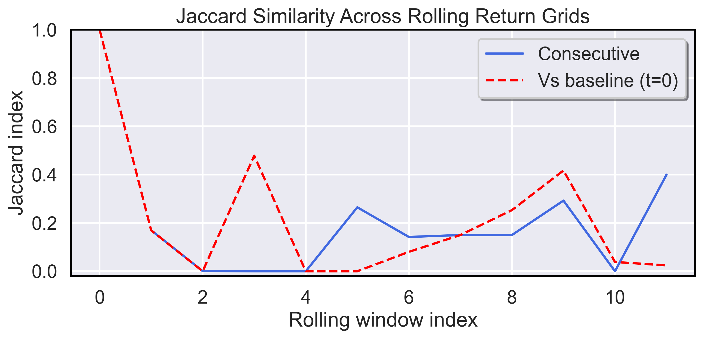
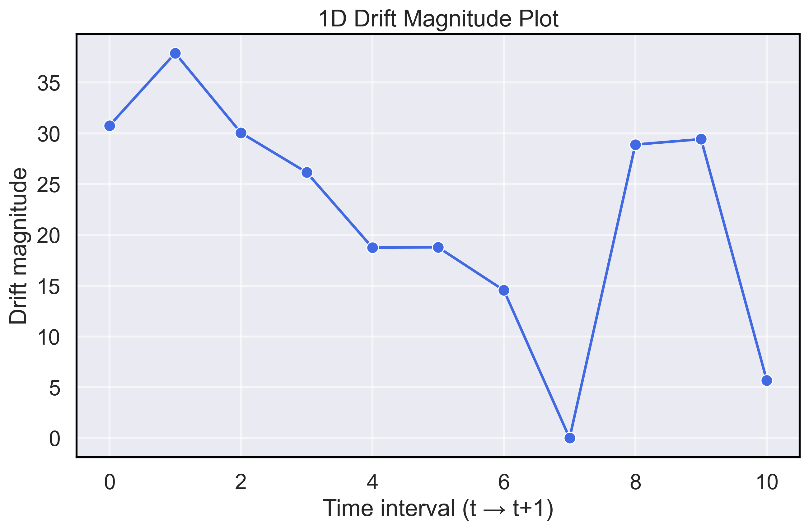
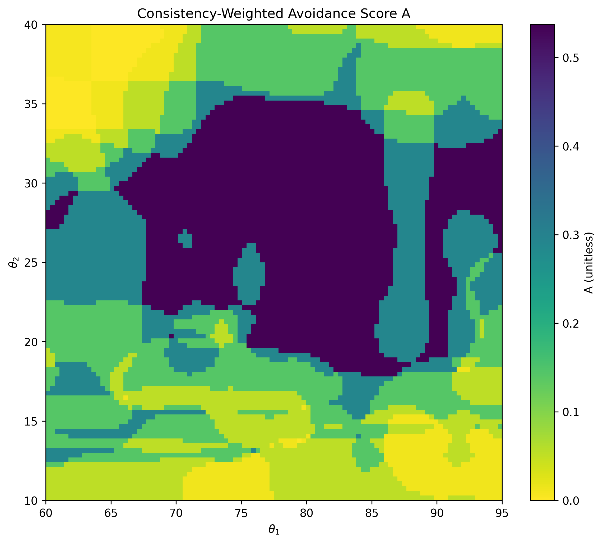
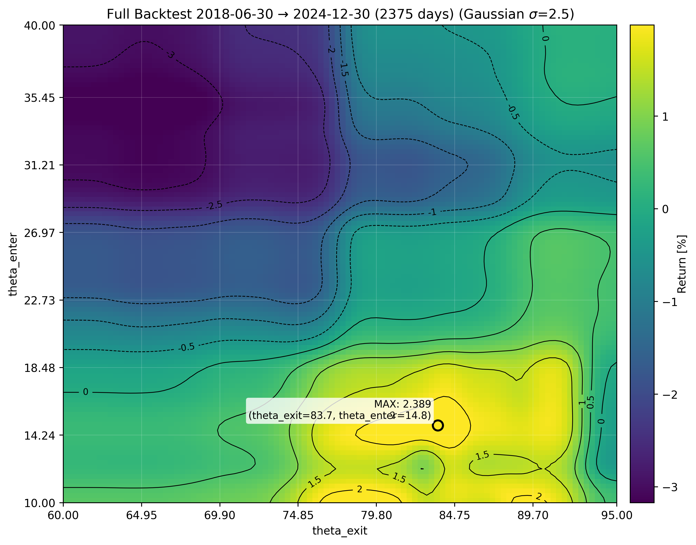

## BTC Results

|  |  |
|-------------|--------------|
|  *Figure 1. **Jaccard Index** – Similarity of top-performing regions across time slices. “Consecutive” compares each interval to the one before; “Baseline” compares each interval to the initial (t = 0).*  |  *Figure 2. **Drift Magnitude** – Magnitude of parameter-space shifts between maximum centroids in consecutive intervals.* |
|  *Figure 3. **Modified Entropy** – A Bernoulli–Shannon–style entropy, weighted to penalize regions that consistently perform poorly across time intervals.* |  *Figure 4. **Full Backtest Heatmap** – Percentage-return surface as a function of θ_enter and θ_exit.* |

  
*Figure 5. **Stitched Time-Interval Heatmaps** – Overlapping optimization heatmaps across sequential time intervals. Highlights how the performance surface evolves over time and where stable regions persist.*
