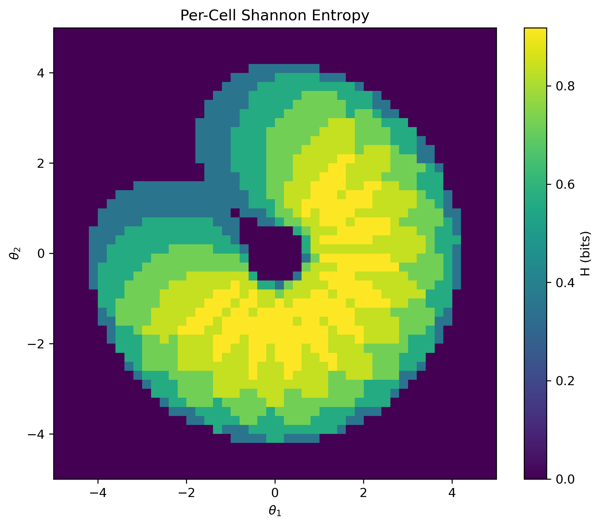
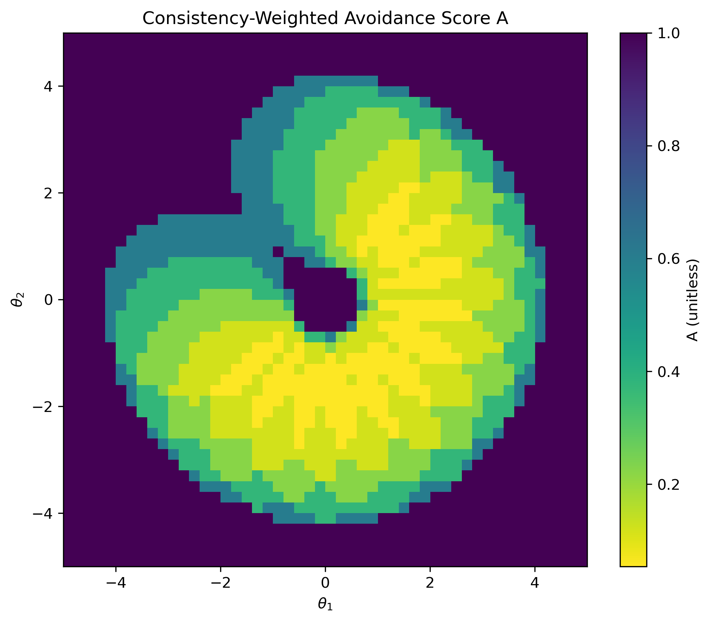

# Entropy Intuition

This document provides intuition for the **Bernoulli-Shannon entropy plots** used in the SAMBO Rolling Stability Lab.

---

## Definition

* For each parameter cell in the grid, we observe whether it belongs to the **Top-X% region** in each time window.
* This gives a binary sequence over time (1 = cell is in Top-X%, 0 = not).
* We then compute **Bernoulli-Shannon entropy** on that sequence:

$$
H(p) = - p \log p - (1-p) \log (1-p)
$$

where $p$ is the fraction of windows in which the cell is selected.

---

## Why Entropy?

* **Low entropy (H ≈ 0):** the cell is either *always in* or *always out* of the top region → highly stable behavior.
* **High entropy (H ≈ 1):** the cell flips in/out across windows → unstable performance.
* This helps identify which parameter regions are consistent vs. noisy.

---

## Entropy Dummy Example Data for Intuition

To build intuition for stability metrics like Jaccard, we generate a simple **synthetic dataset** of drifting Gaussian peaks:

- We define a 2D parameter grid (50×50) and simulate 15 rolling time steps.  
- At each step, we place a Gaussian “bump” whose center slowly drifts in a circular pattern across the grid.  
- The Gaussian represents a region of high performance, while surrounding areas represent poorer returns.  
- We then mark the **top 10% of values** in each surface as the region of interest (ROI), producing a binary mask for each time step.  
- This yields a stack of binary masks (`stack_bool`) over time, mimicking how optimal regions evolve and drift.  

  
*Figure 1: Entropy highlights unstable regions (high H) vs stable regions (low H).*

---

## From Entropy to Consistency-Weighted Avoidance Map

The plain entropy heatmap 
$$
H(p) = -\,p \log_b p - (1-p)\log_b(1-p),
$$
measures **uncertainty** in whether a cell belongs to the top-$X\%$ region.  
- $H=0$ when a cell is always $0$ or always $1$.  
- $H$ is maximal at $p=0.5$ (unstable / fluctuating cells).

For optimization, however, we are most concerned with **consistently bad regions** (cells that are nearly always $0$).
To emphasize these, we define a new score, the avoidance map,
$$
A = (1 - p)\,\Bigl(1 - \tfrac{H}{H_{\max}}\Bigr), \qquad H_{\max} = \log_b 2,
$$
where $p$ is the empirical fraction of $1$s (membership rate). The avoidance map identifies consistently poor regions of parameter space that should be ignored in optimization.

- If a cell is consistently excluded ($p \approx 0$, $H \approx 0$), then $A \approx 1$ (highlighted).  
- If a cell is consistently included ($p \approx 1$), then $A \approx 0$ (suppressed).  
- If a cell fluctuates ($p \approx 0.5$, $H \approx H_{\max}$), then $A \approx 0$ (not mistaken for consistently bad).

Thus, the **consistency-weighted avoidance map** $A$ highlights regions that should reliably be ignored when searching for optimal solutions.

---

## Avoidance Map Dummy Example Data for Intuition

This toy setup also provides an intuitive way to illustrate how **entropy-based metrics**, namely the avoidance map, distinguish between unstable regions, consistently strong regions, and consistently poor regions in parameter space.

  
*Figure 2: Consistency-weighted avoidance map. Dark regions indicate parameters that are consistently poor (to be avoided), while lighter areas show stable or fluctuating regions.*
