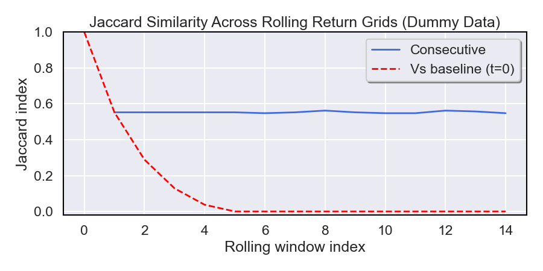

### Understanding the Jaccard Index for Rolling Return Grids

The **Jaccard index** is a measure of similarity between two boolean masks  
(e.g. the top-performing regions in two rolling return matrices).  
It is defined as:

$$
J(A, B) \;=\; \frac{|A \cap B|}{|A \cup B|}
$$

where:
- $A \cap B$ is the set of cells where both masks have value 1 (the intersection),
- $A \cup$ is the set of cells where at least one mask has value 1 (the union).

---

#### Key Intuition
- **Jaccard only cares about the 1s** (the selected or “active” region).  
- Cells where both are 0 do **not** contribute to the score.  
- This makes Jaccard especially suited for comparing *highlighted top regions* that are typically sparse.

---

In this work, each window produces a *Top-X% region* of parameter space. Jaccard between consecutive windows measures *how much of that region persists over time*.

**Intuition:**

* $J=1.0$: perfect stability (same region).
* $J=0.0$: complete turnover (no overlap).
* $J\approx0.4$: moderate persistence.

---

#### Contrast with Accuracy / Hamming Similarity
- **Accuracy (or Hamming similarity)** would be:

$$
\text{Accuracy}(A,B) \;=\; \frac{|A \cap B| + |(\neg A) \cap (\neg B)|}{\text{total cells}}
$$

This counts agreement on both 1s *and* 0s.  
If the ROI is very small (lots of 0s), accuracy will appear artificially high,  
even if the top regions barely overlap.

- **Jaccard** avoids this problem by ignoring 0–0 agreements and focusing only on overlap in the **selected region**.

---

#### Why Jaccard for Return Heatmaps?
In rolling optimization heatmaps, we want to know if the **best-performing region** (e.g. top 10%) is stable across time.  
Jaccard directly answers: *“Of all the cells marked as top in either window, what fraction are shared?”*  
This makes it much more appropriate than accuracy for tracking **consistency of top regions** over time.

### Dummy Example Data for Intuition

To build intuition for stability metrics like Jaccard, we generate a simple **synthetic dataset** of drifting Gaussian peaks:

- We define a 2D parameter grid (50×50) and simulate 15 rolling time steps.  
- At each step, we place a Gaussian “bump” whose center slowly drifts in a circular pattern across the grid.  
- The Gaussian represents a region of high performance, while surrounding areas represent poorer returns.  
- We then mark the **top 10% of values** in each surface as the region of interest (ROI), producing a binary mask for each time step.  
- This yields a stack of binary masks (`stack_bool`) over time, mimicking how optimal regions evolve and drift.  

This toy setup provides an intuitive way to illustrate how metrics like **Jaccard overlap** and **centroid drift** capture persistence and movement of top-performing regions across time.

### Interpreting the Jaccard Results

- **Consecutive Jaccard is roughly constant**  
  Because the Gaussian “blob” only drifts a little each step, the overlap between *adjacent windows* remains fairly stable.  
  Each new top-10% region shares a large portion with the previous one, so the Jaccard index stays at about the same level over time.

- **Baseline Jaccard decays**  
  When we always compare back to the very first window, the blob gradually drifts away.  
  As a result, the overlap with that fixed baseline shrinks steadily.  
  Eventually the top regions barely overlap at all, and the Jaccard value approaches zero.
